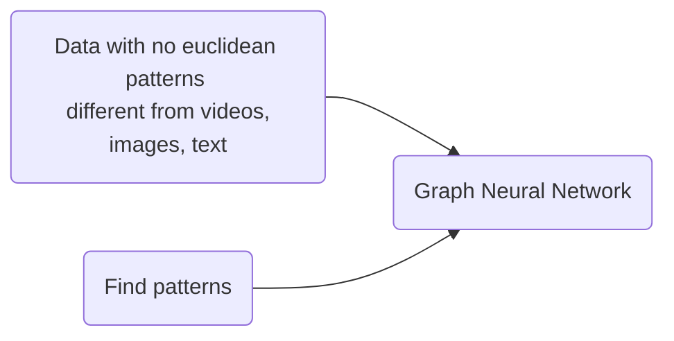
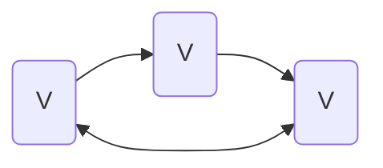
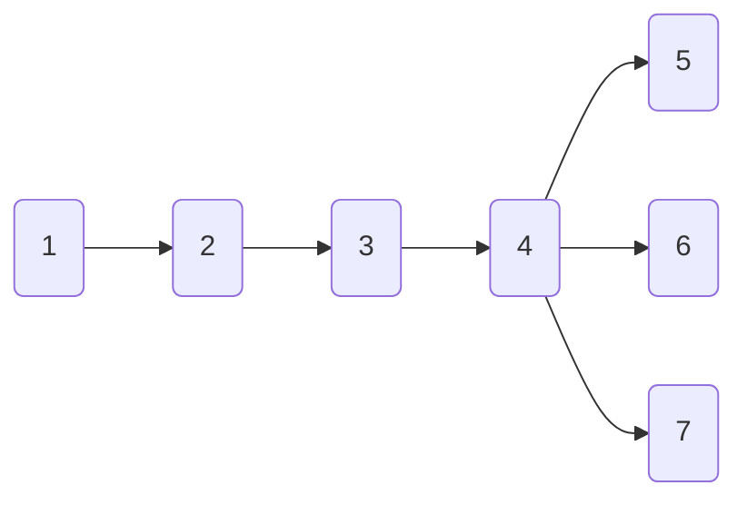
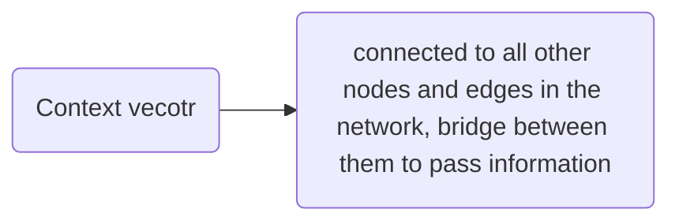

# Reference
* https://neptune.ai/blog/graph-neural-network-and-some-of-gnn-applications
* https://distill.pub/2021/gnn-intro/

# Introduction

Deep learning is good at capturing hidden patterns in *Euclidean data: Images, Videos, Text*
but what about when data doesn't follow *euclidean patterns* $\rightarrow$   complex relationships and interdependencies between objects 

# Graph, definition

What is a graph?. Let's take a look to the following image

the *nodes* or also denoted as *vertices* and the edges (arrows) conform a graph. So, a graph is a set of vertices and edges that stablish a relationship between them. Therefore, a **graph** can be defined as $G = (V,E)$ a set or vertices and the edges between them (E).

**A** graph can represent things like a social network or molecules. In a socual network the nodes will be the users and the edges how this users related between them.

### Mathematical representation
A graph is represented by **A**, an *adjacency matrix*. If the graph hast n nodes, the dimensions of A will be nXn

*adjacency matrix, definition* The elements of the matrix indicate whether pairs of vertices are adjacent or not in the graph

### Difference with euclidean data (CNN)

The big difference between graphs (*GNN*) and the other type of data (CNN) is the relationship between them. For example, images and text or audio can be thought as graphs with either square or linear relationships, which are more simple to analyze and identify patterns.
In the next image you can look this behavior
![[graphs.png]]

So, we want to do the same as with CNN, obtain insights about the information and how they relate, but in a more complex topology. For instance, graphs don't have a fixed structure and applying a kernel of the type used in CNN won't bring the same results.

# What type of problems have graph structured data?

There are 3 general types of predictions tasks on graphs:
	**1.** graph level: We predict a *single property* for the whole graph 
	**2.** node level: We predict *some propery* for each node
	**3.** edge level: We want to predict the *property* or *presence* of edges in a graph

For all oh the above mentioned problems they can be solved with a **single model class: GNN** 

# The challenges of using graphs in machine learning

Graphs have up to 4 types of information we will potentially want to use to make predictions:
nodes, edges, global context and connectivity.
They represent graphs with **adjacency lits**, these describe the connectivity of edge $e_k$ between nodes $n_i$ and $n_j$ as a touple (i,j) in the k-th entry of an adjacency list. 

the corresponding adjacency list will represent the connections between nodes as a tuple
$$
e_k = [ [1,2],[2,3],[3,4],[4,5],[4,6],[4,7]]
$$

# General idea of how GNN works

So we have our graph and we want to make predictions with this. Predictions can be of any type: binary, categorical, linear regression. Now we need to define how we are going to deal with our information, remember that we have information in nodes, edges, and globally.

The following explanation is the starting point and the simplest one, it only considers the information in each entity and not the relationship between them, for example how different nodes are related and what are their impact.
So the main idea is as follows: we apply some kind of model (convolutional, linear regression, fully connected, among others) to each of our entities. For example if we are interested in node prediction we will apply this model to single one of the nodes, but if we are interested in edges, we will apply it to the edge. Applying this we will obtain a prediction for each node (or edge, or global). In this scenario the method we applied does not change the relationships among the graph and the structure is preserved. 
*==What if we want to include information of edges into nodes or nodes into edges?==* In this scenario we are going to do an extra step before applying our selected method and is adding the information of edges to the nodes, for this we can use pooling: gather the information of the edges, add it to the nodes and then proceed as before. You can see the main idea in the following Image.
![[edge_aggregation_node.png]]
in this case the information of the edges surrounding the node is added to the already existing information in the node. This step is done for each node and their corresponding edges.
We can represent this layer with the symbol $\rho_{E_n \rightarrow V_n}$ in the case the information goes from Edges into vertices (nodes).

In the following Image you can see how the whole procedure works. You apply the pooling and then the classification layer (this layer can be anything according to the problem), and finally you will obtain the prediction.
![[edge_predictions.png]]

A generalization of the previous part is presented in the following Image
![[prediction_task_end_to_end_GNN.png]]

**Observation** The node and edge information stored in a graph are not necessarily the same *size* or *shape* 
***A possible solution*** is to learn a linear mapping from the space of edges to the space of nodes, and vice versa. Alternatively, one may concatenate them together before the update function 

### Adding global representations

There is one possible flaw in our approach: nodes that are too far away from each other may never be able to efficiently transfer information to one another.
* If we have *k-layers* (number of layers in our GNN), taking as reference one node, the information will be propagated *k steps* away (to K nodes)
**Possible solution** is by using the ==global representation== of a graph (U) which is sometimes called a ***master node*** or ***context vector*** 

For example, the next figure represents the implementation of the above discussed methods. You have the node embedding, the adjacent nodes embeddings, adjacent edges embedding and finally the global embedding (which connect all nodes). This embeddings make reference to some kind of function of transformation over the information of each entity. Then you apply an update function which merges all these embeddings, it could be a mapping or just concatenating. And finally you can apply a convolutional layer or other type.

![[nodes_connections_and_embeddings.png]]

### GNN Playground

Among the things you can change when designing a GNN are:
* The number of GNN layers, also called depth: How many layers will pass information between node, edges
* The dimensionality of each attribute when updated: If after merging nodes, edges, the new attribute will keep the same dimensionality or it will change
* The aggregation function used in pooling: max, mean or sum
* The graph attributes that get updated: nodes, edges and global representation

***Context of the Playground*** we are going to predict if a molecule produces an odor or not (graph-level prediction task). For this, each graph will consists of nodes one hot encoded (carbon, nitrogen, oxygen, calcium) and bonds are edges containing a one-hot encoding its bond type: single, double, triple or aromatic
![[play_ground_graph_prediction.png]]

### Sampling Graphs and Batching in GNNs

The main idea with *batching* in graphs is to take a certain number of nodes and edges that preserve as much as possible *essential* properties of the initial graph. This operation is highly dependent on the context. It is also important to consider that batching might have sense in some contexts but in others it will just make a new graph, for example considering a molecule, if you take a sub-graph of the original molecule, essentially, you are considering a new and smaller molecule

### Regarding models

In the case of graphs, we care about how each graph component: edge, node, and global is related to each other so **we seek models that have a relational inductive bias**.
==A model should preserve explicit relationships between entities== (adjacency matrix)  and preserve graph symmetries (permutation invariance)

### Graph explanations and attributions

We care about GNN model interpretability. The issue here is that graphs are so versatile and different that sometimes is difficult to create an unique parameter for interpretation.
***GNNExplainer*** casts this problem as extracting *the most relevant subgraph that is important for a task* 
* **Attribution techniques** assign ranked importance values to parts of a graph that are relevant for a task 
![[explanability_example_GNN.png]]

## Tutorial: Hands on

link: https://uvadlc-notebooks.readthedocs.io/en/latest/tutorial_notebooks/tutorial7/GNN_overview.html

#### Graph Attention

It is a solution for the case when you are passing information from neighbor nodes to a specific node, and due to the shape of the graph this node is "isolated" is someway. The result after multiply layers (each layer pass one neighbor node information to the next one) is that it is possible that some information gets lost.
This method is named ***GAT***
**How does it work?** It creates a message for each node. For the attention part, it uses the message from the node itself as query, and the messages to average as both key and values (note that this also includes the message to itself). **Result** the value more similar to the query has a bigger weight, this means that the message of the same node is tried to be preserved.

Let's take a look to some illustrations to understand better how this works:
![[graph_attention.jpeg]]

The information in node $\vec{h_1}$ is updated as follows: for each neighbor node a weight is determined (and of the itself node), $\vec{\alpha_{i,j}}$ , then this weight is multiply by the message on its own node. Finally, the information is updated taking the concatenation and then the mean of all neighbor nodes.
The way how the weight is obtained is depicted in the following illustration
![[graph_attention_MLP.svg]]
In order to obtain $\vec{\alpha_{i,j}}$ the neighbors of that node are considered, the message (information) in each neighbor node is multiply by a weight which is the attention weight. then all these nodes are concatenate and a SoftMax function is used to obtain the weight.

# Basics of deep learning for graphs 

**Node embedding** mapping nodes to a d-dimensional embedding space (a low dimensional space), so that similar nodes in the graph are embedded close to each other. We want to reduce the dimensionality of our graph, this is similar to what we do with CNN, we obtain the most important features.

