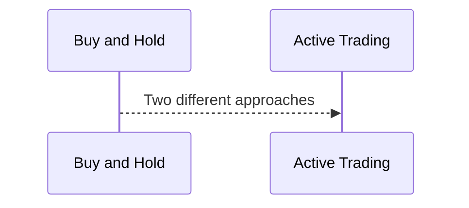
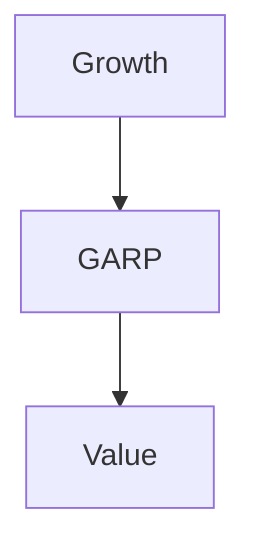

### Key Concepts when Investing and Trading in The Stock Market

### How to Read a Stock Quote
The first thing is to find a website where you can see stocks quote. in USA, for example, yahoo finances. For the rest of the world investing.com.

Let's take a look to how yahoofinances look and what is in the main page with the example of a company
![[Sotck_Quote_screenshot.png]]
In this example the company in General Mills. 
Below the name you can see the current price at which the stocks are being selling in green (or red) the increment (or decrement) and then the percentage of this change.
Inside the red square you can find ***Previous Close*** which is the value at which the stocks close the day before. ***Open*** is the price at which stocks price open the day. ***Bid*** and ***Ask*** was already cover and another page. ***Day's range*** is the range at which the stocks have been sold. ***52 Week Range*** is similar to day's range but related to 52 weeks period ( 1 year ). ***Volume*** is the volume of stocks that are traded.
**Beta** is an important concept and it is related with the volatility of the stock. This value can be:
* $\beta = 1$ means that the the stock's price will behave as the market. If the market goes up or down the stock's value will do it in the same way
* $\beta <1$ This implies a more stable stock's price but at the same time more conservative earnings or losses. For example if $\beta = 0.5$ and the market goes down or up the stock's price will move in the same direction but only half the magnitude in comparison with the market.
* $\beta >1$ In this scenario you can have big earnings but at the same time big losses. The idea is the same as before. For example if $\beta = 1.5$ and the market goes up or down the stock's value will do it 50% more or less.

Now, let's take a look at how to read a **Stock Chart**
![[Stock_Chart_sample.png]]
In this example we are using the company General Mills. Let's mention some general aspects about the features of this chart. The ***Date Range*** is the time I want to see, in this case the las 6 months. ***Interval*** makes reference to how much time will be considered in each point of the graph, for this case is 1 day, this means that each candle-bar corresponds to one day.
***Candle*** selects the way we want to see the information for the period of time we selected.
Considering the plot, we can see two colors green and red. Green means that the stock's price increase by the end of the day in comparison with the opening. Red is that the price decreased. For the case of candle-bar, if the color is red, the opening price will be at the top and the closing price will be at the bottom. The x-axis makes reference to time and the y-axis to the price.
Additionally, you can find another bar plot at the bottom of the plot, this shows the volume of transactions carried out for that period of time.

### Types of Stocks: Growth Stocks, Dividend Stocks, and Value

Different things to look at when diversifying:
1. Size of the company: small cap, middle cap, large cap
2. Growth and income (value)
3. International
4. Sectors

#### Size: Large, Middle, and Small Cap Stocks
How Stocks are organized?
1. **Size:** How do we determine what is a large, middle or small company? This is done through ***Cap***. This is calculated with $cap = (stock \; price)*(Number \; of \; shares)$. Let's take a look to some ranges
	Large: +$10 billion
	Mid: $2-10 billion
	Small <$2 billion
	
2. **Style**
***Growth Stocks***  The price of your stock to go up. Typically no dividend and focus on re-invest cash in growing company. *Earnings* grow faster than industry and market. Higher price to earning (*P/E*) and higher price to sales. Example: Google
***Dividend Stocks*** They pay a dividend, but they still want to grow the company and stock price. Example: Coca-Cola
***Value Stocks*** Companies that are for sale, it means that the stocks are cheaper, higher long term gain, *greater risk*. May be these companies are about to go bankrupt 
3. **Sector** 
* What part of the economy
* What is their primary business
* Important for comparison with competitors *ratio*, 

### What to Buy: Individual Stocks, Stock Mutual Funds, and ETF

#### Individual Stocks
Some advantages are:
* More control: you decide when to sell, tax efficient
* More targeted
some disadvantages are:
* Less diversified
* More hands on: Research, tracking
Normally you are more involved with the company and know how it operates because you are buying that specific stock from that company

#### Mutual Funds
* Pool of investors: Sharing risk and reward
* Diversified holdings
* Professional management: Active Vs. Index
* Liquidity: Easy to buy and sell

### Active Vs. Index Stock Mutual Funds
* Index fund means you are trying to match the market that the index follows. You don't try to beat the market, you try to be average. Vey passive style of investment.

***For Index Mutual Fund:***

| Advantages | Disadvantages |
| - | - |
| Lower cost | No fund manager with vested interest |
| potential for more diversification | can be less diversifies  |
| . | can be heavy weighted in a few positions (Example: S&P 500) |
|.  | Index down as a whole |

### Using The Mutual Fund Style Box To Select Funds
The style box will show me the current position (category) of the fund I am interested.
![[StyleBoxRed3.png]]
### Mutual Fund Expenses
* Sales Charges (Load): Front end/back end 3% or more. That's the privilege of buying that fund. I have to pay in order to be able to buy that fund. They take 3% of my money when I buy the fund. It is just one time. 
* Expense Ratio (Average 1%): Operating Expenses, 12b-1 marketing (.25%). I will be charged an annual basis. 
* Miscellaneous Charges (Not in expense ratio): custodial fees ($10), hidden fees
* Redemption Fee (1%): Fee is sell before certain time frame, discourage market timers. You will be this fee when you sell your fund.

### ETF: Exchange Trade Funds
* Hold basket of underlying assets (Ex, stocks, bonds, etc), diversification
* Typically track an index
* Low expenses ratio
* Trade on market like a stock
* Price changes during the day
* Liquidity like a stock (No NAV)
* Pay commission to a broker like a stock
* Can buy 1 share (no minimum like mutual fund)

The price of mutual funds is daily basis, this mean that the price of the stock is update once per day, while ETF is updated throughout the day.

## Strategies: Investing and Trading Strategies In The Stock Market

### Two Investing Extremes

Two extremes:

#### Buy and Hold

| Advantages | Disadvantages |
| - | - |
| Easier to manage | Missed opportunities|
| Reduced transaction fees | Reluctance to sell poor performers |
| Better tax efficiency | . |
| Trying to time the market is hard | . |

### Active Trading

| Advantages | Disadvantages |
| - | - |
|  Take advantage of new opportunities | More time devoted to investing|
| Sell those losers | Increased transaction fees/taxes |
| Re-allocate faster in volatile markets | Investing rewards patience with compounding|
|.|Typically underperforms over long time|

### Investing in Growth Stocks

* It will be priced high to market
* Momentum drives price up
* May not profitable yet
* Great for:
	* Long-term investor
	* Patience betting on future
	* able to withstand volatility rollercoaster
* Protect downside (Down 20% get out?)
* Looking for:
	* fast rising sales and earnings
	* Low debt

##### Tips
* Growing industry
* Megatrends
* Strong Brand-Barrier to entry
* Insiders (mgmt.) buying: people inside the company, what they are doing, buying stocks, selling the stocks. If they are buying their own stock that's a good sign 
* Fundamentals:
	* Sales increase 10%
	* Earnings increase 10%
	* Debt lower than previous year
	* ROE 10%+

### Investing In Dividend Income Stocks
this type of stocks will pay me money every certain period of time (quarterly). They won't growth as fast as a growth stock. They are good for retires income.
* Low interest rate 
* Typically Large Cap
* Looking for consistent dividend payouts. 

#### Tips
* Company stability
* Sector stability
* Use same *Fundamental Analysis* and *Ratios*
* key in on:
	* Dividend yield (% you are paid): 
	* Dividend growth rate
	* consistent dividends
	* Dividend payout Ratio: How much of the money the company is doing is used in dividends, the other part can be used in growing the company or other issues
		* 80% is concerning
		* 50-70% is good

### Investing in Value Stocks

Those are stocks that are neither growing nor paying dividends, they are more volatile and can represent a great income as a great lost. 
* Hidden Gems
* Market Undervalues *SALE* 
* Key Ratios (compare to average)
	* Lower price to book
	* Lower Price to Earning ratios (P/E)
	* High dividend yield
* Future growth-cash flow 

### GARP: Growth At a Reasonable Price
* It is a combination of *Growth* and *Value* investing
* Looking for:
	* Somewhat undervalued stocks
	* Sustainable growth potential
* In between (Wishy-Washy)

#### How to value this stocks? (identify if they are good or not)

***Qualitative important*** 
* What is the strategy, what is going with the industry, what is the demographic

***Quantitative important***
* Recent Past and Future projected earning growth
* EPS more subdued 15-20% range (Earnings Per Share)
* P/E higher than value but lower that growth investor (15-20 range)
* PEG value <1 and prefer near 0.5 (Price/Earnings to Growth Ratio)

*Definition: PEG* it is P/E ratio divided by the growth rate of its earnings for a specific time period. The PEG ratio enhances the P/E ratio by adding expected earnings growth into the calculation. similar to the P/E ratio, a lower PEG may indicate that a stock is undervalued. A PEG lower than 1.0 is best, suggesting that a company is relatively undervalued.

### Technical Analysis and Charting

It consists of looking at past movements (example: price or volume) to predict future. Very much as a trading tool.
* Assumptions: 
	* Market price is the actual price as all information known (No Value Invest)
	* Price movements are not random
* Looking for trends: the behavior continues

## Dogs of The Dow (**strategy**)

They are the 10 of the 30 USA fortune 500 companies in the *Dow Jones Industrial Average* (DJIA) with the highest **dividend yield**
* **Main Idea** They are good stocks (that's the reason they are in DJIA) but are not doing so good right now. So low price-higher dividend yield
* Each year rebalance to select new 10

### Dividend Aristocrats (**strategy**)

* S&P 500 companies that have *increased dividend for 25 straight years*
* Strong in rising markets and extra strong  and safe in falling markets
* You select the best companies

### DARTS (**strategy**)

This propose to pick stocks in a random way. Select a bunch of companies and randomly select some of them.

### Developing Your Stock Market Investing And Trading Strategy

* Trade what you know : Sector, industry, company
* Your trading style: ***How often do you want to trade?***
* Leverage tools based on above: company Eval, Fundamentals and Technical analysis, watch list, what to buy, when to buy it
* Decide the number of Stocks to trade: Few or Many?

**Definition: Dividend Payout Ratio*** Thus is the percentage of earnings made by the company that is pay to shareholders through dividends. The amount that is not paid to shareholders is retained by the company to pay debt or to reinvest in core operations.
$$
DPR = \frac{Dividends \; Paid}{Net \; Income}
$$
**Definition: Dividend Yield*** A financial ratio showing the return an investor would earn from an investment based solely on its dividend payments. It is expressed as a percentage. It is how much a company pay in dividends each year relative to its stock price.
The *reciprocal* of the dividend yield is the *dividend payout ratio*. ***Something to consider*** a higher dividend yield is not always an indicator of  a good opportunity to buy a stock of that company, because the dividend yield can be raised as a consequence of a decrease in the stock price
$$
DY = \frac{Annual \: Dividends \: Per \; Share }{Stock \; Price}
$$

## Picking Stocks: Qualitative Company Evaluation (Competitive Advantages and More)

### Company Strategy and More Evaluation

* ***Mission statement drives the company***
	* What do we do?
	* Whom do we serve?
	* How do we serve them?
* ***Strategy*** (Example for a retail store chain). *The what*
	* Grow our market chain
* ***Tactics*** *The how*
	* open 15 more locations
	* Buy the #4 competitor and merge them with us

### SWOT Analysis

It is used to evaluate a company: ***S***trengths, ***W***eakness, ***O***pportunities, ***T***hreats.
So the idea is that you make a matrix like the next one
![[SWOT_en_svg.png]]

### Porters 5 Forces Analysis

It is used to evaluate a company industry position. 5 things that are external to the company and can affect it.

![[porters_5_forces.webp]]

## The Moat [**Maybe one of the most important metrics for assessing company value**]

### Low Cost And Differentiated Companies
*Low Cost Providers* Companies that focus on low cost, price is everything
*Differentiated* High price (maybe), but differentiated: it has something special: status, quality, customer service, gifts.

**Ideally Not Stuck in the Middle** Between low cost provider and differentiated.

### High Switching Cost
*Painful or expensive for a customer to switch to a competitor*

### Network Effect

* It is expensive for a *competitor* to build out a competing network or infrastructure

### Strong Brand Name

* Customers have strong emotions and attachments to the brand
* *Trust*
* Can charge higher price and drive profit margins 

### Reputation

* Quality
* What does you expect

### Economies of scale

* Massively large upfront costs to even start
* Greater costs savings and higher production levels

## Fundamental Analysis: Picking Stocks Using Ratios

### Key Financial Ratios When Buying Stocks

**Important to compare withing the Industry**
* Some ratios are more important than others, it depends on the type of company 
* There are hundred of ratios. Focus on the most important

There are 5 Key categories:
1. Valuation (Price): Price of the stock
2. Profitability: How profitable is the company
3. Liquidity 
4. Debt (solvency): Does it have levels of debts ?
5. Efficiency (operating): How does work the company, the management, how is running the company

***Is the stock at good price relative to some measure?***

### Price to Earning Ratio (P/E)
It is the ration between the ***P***rice of the share and the ***E***arnings you can obtain by share.
You can understand it as **the price I will pay for $1 of earnings**
* As a *rule of thumb* is that shares trading at *low* P/E are a *value*. Be careful, the definition of "low" varies from industry to industry

### Price to Earning Growth (PEG)

$$PEG = \frac{P/E}{Projected \; Annual \; Growth \; in \; Earnings \; Per \; Share}$$

* As a *rule of thumb* a PEG **Below 1** is a good value

### Price to Sales (P/S)
$$P/S = \frac{Stock \; Price}{Sales \; Per \; Share}$$
* It is more useful with companies that *don't have recent positive earnings* (losses) or with *starting* companies
* *What is a good P/S ratio?* a good value is between 1 and 2 and really good value is less than 1

### Price to Book (P/B)

**When investors are looking for undervalue stocks** 

**Definition** ***Book Value*** is the value of an asset according to its balance shit account. It is a company's value if it liquidated its assets and paid back all its liabilities.

It is computed as the ratio of price (stock) to book value per share
$$ P/B = \frac{Stock \; Price}{Book \; Value}$$
*What is a good P/B ratio value?* a good value is in the range 1-3. An excellent value is lower than 1

### EV/Revenue (Enterprise Value to Revenue) Ratio
EV refers to Enterprise Value. It helps to know what is the company's value 

**Definition** ***Market Capitalization*** it is defined as Price of Stock * number of shares(stock)

	Enterprise value = Market capitalization + Debt - cash (and cash equivalents)
	Revenue = Total annual Revenue 

**USE** It is more use for early stage or high growth businesses that don't have positive earnings yet
**CONS** It is difficult to compare across different industries and different company phases (early vs mature)

*What is a good EV/Revenue ratio value?* a good value is between 1 and 3. lower the better

### EV/EBITDA

The Enterprise multiple can be used as an alternative or to supplement the P/E ratio. 

$$Enterprise \; Multiple = \frac{EV}{EBITDA}$$
**Definition** ***EBITDA*** it is the ***E***arnings ***B***efore ***I***nterest, ***T***axes, ***D***epreciation and ***A***mortization 
*What is a good EV/EBITDA ratio?* less than 10, lower is better (undervalued)

### Price to Cash Flow Ratio
It measures how much cash a company is making relative to its market value (stock price). It is a good alternative to P/E as cash flows are less susceptible to manipulation than earnings 

$$P/CF = \frac{Share \; Price}{Operating \; Cash \; Flow \;Per \;Share}$$

***Example:*** Consider a company with a *share price* of $10 and 100 million shares outstanding. The company has an Operating Cash Flow (OCF) of $200 million in a given year. Its OCF per share is as follows:

$$
OFC_{pershare} = \frac{OFC}{Total \; Shares} = \frac{200*1e^6}{100*1e^6}= 2
$$
And the $P/CF$ will be
$$
P/CF = \frac{10}{2} = 5
$$
**Interpretation** That means that the company's investors are willing to pay $5 for every dollar of cash flow, or that the firm market's value cover its OCF 5 times

### Price to Free Cash Flow Ratio
It is related with the previous ration. But it is a more rigorous measure than the P/CF ratio. It uses Free Cash Flow (FCF) which subtracts capital expenditures (capEx) from a company's total OCF. Companies use this metric when they need to expand their *asset bases* either to grow their businesses or simply to maintain acceptable levels of FCF

*What is a good value* a good value is lower than 15, the lower the better.

## Rations for Dividend Stocks

Remember that this type of stocks pay you dividends every couple of months

### Dividend Yield
$$
DY = \frac{Dividend \; Per \; Share}{Price \; Per \; Share}
$$
In this case as *higher* the *best*. **But** be careful because a high value can be related with a low price per share and maybe the company is going down.

### Dividend Payout

$$
DP = \frac{Dividend}{Net \; Income}
$$
The percentage of profits distributed as a dividend 
*Lower* the *better*. Lower than 50% is excellent, between 50 and 60% is good.

## Profitability ratios

### Return on Assets (ROA)
$$
ROA= \frac{Net \; Income}{Average \; Total \; Assets}
$$
*What it means* A company buys assets (factories, equipment, etc.) in order to conduct its business. **ROA** tells you how good the company is at using its assets to make money.

*Example* a company reported $10.000 of net income  and owns $100.000 is assets. Its ROA is 10%. For every $1 of assets its owns, it can generate $0.10 in profits each year.

**The Higher** the **better**

### Return On Equity (ROE)
$$
ROE = \frac{Net \; Income}{Average \; Stockholder \; Equity}
$$
*What it means* Equity is another word for ownership. It tell you how good a company is at rewarding its shareholders for their investment.

*Example* A company reported $10.000 of net income and its shareholders have $200.000 in equity, its ROE is 5%. For every $1 of equity shareholders own, the company generates 0.05 in profits each year.

**The Higher** the **better**

### Profit Margin

$$
PM = \frac{Net \; icnome}{Sales}
$$
**The Higher** the **better**

Compare within the same market

### Liquidity: Current Ratio and Quick Ratio

***Can a company covers their short-term debts (Bills)?***

They measure a *company's ability to service "pay" their short term debt*
* Short term debt not longer term debt

Current ratio: $\frac{Current \; Assets}{Current \: liabilities}$

* Current Assets: Cash, account receivable, inventory and other things that are expected turned into cash less than one year
* Current liabilities Accounts payable, wages, taxes payable, ant the current portion of long-term debt

**The Higher** the **better**

**Quick Ratio:** $\frac{CE + MS + AR}{CL}$
CE: Cash and equivalents
MS: Marketable securities
AR: Accounts receivable
CL: Current Liabilities

* It looks at assets that are ***more liquid*** and can be ***easily*** turned into ***cash***
**The Higher** the **better**

### Debt: Debt to Equity
*It is one of the most popular debt ratios*
Formula: 
$$
DTER = \frac{Total \; liabilities}{Total \; Shareholder \; Equity}
$$
DTER: Debt To Equity Ratio

It measures the relationship between the amount of capital that has been borrowed (i.e. debt) and the amount of capital contributed by shareholders (i.e. equity)

**General speaking** as a firm's debt to equity ratio increases, it becomes more risky because if it becomes unable to meet its debt obligations, it will be forced into bankruptcy

**Lower** is **better** 

### Debt: Interest Coverage

$$
CR = \frac{EBIT}{Interest \; Expense}
$$

***EBIT*** Earns before interest and taxes

It measures of how well a company can meet its interest payment obligations. If a company can't make enough to make interest payments, it will be forced into bankruptcy.

**Anything lower than 1 is usually a sign of ==trouble==**

### Efficiency: Asset Turnover

$$
ATR = \frac{Sales}{Average \; Total \; Assets}
$$
How is good the company  at using its assets to make products to sell.
***Example*** A company A reported $100.000 of sales and owns $50.000 in assets, its asset turnover ratio is
$$
\frac{100.000}{50.000}=2
$$
For ever $1 of assets it owns, it can generate $2 in sales each year.

### Efficiency: Inventory Turnover

$$
ITO = \frac{Costs \; of \; Goods \; Sold}{Average \; Inventory}
$$

***Meaning*** If a company holds inventory, I want that company to be selling it as fast as possible, not stockpiling it. The inventory turnover ratio measures this efficiency in cycling inventory.

**A high** ratio indicates that the firm is selling inventory relatively quick

**The higher** the number the **better**

## Picking Stocks: Technical Analysis Using Charts, Patterns and Trends

### Understanding Technical Analysis and Fundamental Investing

* Technical Analysis may be used to more **short term investing**
* *The only thing that matters is the ==CHARTS==*
* It is about the ***Herd mentality*** 
* **Momentum Investing** Things that are in motion tends to stay in motion. In this case, ==markets== 

### Technical Analysis Core Concepts
* ***Repeatable Behaviors*** under repeatable circumstances
	* Predictability
	* Not guess work --> Strategy
* ***The Trend is your Friend***
	* Identify trend before breakout
	* Get in and out (Trading)

### Technical Analysis and Unpredictable Events Example

### Line Charts
The height of the line in the "volume", indicates the volume of trading, how much people were trading that day

### Candlestick Charts
the color green indicates that the closing price is higher than the opening, in the other hand if the candlestick is red, it means that the closing price is lower than the open.
The length of the line indicates the higher and lower price during that time period.

### Drawing Trend Lines and Channels

* **Down Trend** Connect highs
* **Uptrend** Connect lows

![[trend_lines.png]]
**Question**  How reliable are this trend lines?, can really predict the future behavior?
==Investigate more about this topic==

### Moving average: Simple and Weighted

What I understood is that is just a simple moving average, you can weighted if you decide to give more weight to the most recent days for example. You will look for candlesticks that cross the moving average because this might indicate a change on the current trend

### Chart Patterns: Rectangles (Support and Resistance Lines)
Not really useful for what I understood

### Chart Patterns: Triangles
![[Ascending-Triangle-Chart-Pattern-1024x735.png]]
Like in the above image. With the trend you can draw two lines.
The lower price in the stocks is the *support line* and the upper price is the *resistance line*. What is happening is that the stock price is fluctuating between high and low price but with a trend to increase the price. So normally, this trend will be kept but again **there is no guarantee in anything**
There is ascending triangles, descending triangles and symmetrical triangles

### Chart Patterns: Flags

The chart pattern looks like *flags*. The pole of the flag is the volume of trading.
To find it you have to look for a lot of volume trading and whether the price increases or decreases. 
**Definition**
In the context of technical analysis, a flag is a price pattern that, in a shorter time frame, moves counter to the prevailing price trend observed in a longer time frame on a price chart.
![[flags.webp]]
In the above image you can see how after some time the flag appears, the high volume and the trend, the trend will change: from decreasing price to increasing price.

### Chart Patterns: Head and Shoulders

*==*"The head and shoulders pattern is considered one of the most reliable trend reversal patterns. It is one of several top patterns that signal, with varying degrees of accuracy, that an upward trend is nearing its end"==

![[head_and_shoulders.webp]]
Once the support line is break it, anything can happen. But if you identify, for example the first shoulder, you can guess your stock will increase in price but then it will fall to the next shoulder.
*interpretation* so in order to win money, you need to sell your stock before or just at the point the head is reached.
It can also exits an inverse head and shoulder, in this case the price will trend to decrease.

### Chart Pattern: Cup With Handle

It combines:
	* Price Patterns
	* Volume levels
	* Moving average

**It is used to consider buying opportunities** 
![[CupHandle.webp]]
When considering a ***Cup and Handle pattern*** it is worth to consider the following:
1. ***Length***: Generally, cups with more *U* shaped bottoms provide a stronger signal. Avoid cups with sharp *V* bottoms
2. ***Depth:*** The cup should not be overly deep. Avoid *handles* that are overly *deep*
3. ***Volume:*** as it is depicted in the previous image: Volume should decrease (or at least don't increase) as prices decline and remain lower than average in the base of the cup. It should then increase when the stock begins to make its move higher

## Risk And Risk Measures In the Stock Market

### Sharpe Ratio
It adjusts a portfolio's past performance (or expected future performance) for the ***excess risk*** that was taken by the investor.

*interpretation* suppose you can make X amount of money with a free risk investment, now the question is if I can make an extra return how much risk it will be. This is what the *Sharpe ratio* tell us, how much risk it represents for an increase in the earnings

**A Sharpe Ratio above 1 is good** 

**How to compute it?**
The equation is the following
$$
SR = \frac{Return - Current \; Risk\;Free\; rate}{Standard \; Devitation (Volatility \; Measure)} 
$$
*Example:* A mutual fund with a return of 15% over the last year, the current risk free rate is 3.5% and the volatility measure is 12%. According to this the SR will be
$$
SR = \frac{15-3.5}{12} = 95.8\%= 0.958
$$
Given that the SR is lower than one, it is not a great Sharpe Ratio

### Beta

*The common measure of risk*
It measures the amount of risk (volatility) an individual security, fund, or ETF has relative to a broader index.
* The broader market is assigned a beta of 1.0

* 0<beta<1: less volatile than the market (cash has 0)
* beta=1.0 mirrors the volatility of whatever index is used to represent the overall market
* beta>1 denotes a volatility greater than the broader index

### Alpha

It is more about performance. It refers to excess returns earned on an investment above the benchmark or index return

***Positive number*** means outperformed the broader index
**as higher better** but also take into account *beta*. 

### R-Squared

It represents the percentage of a mutual fund portfolio or a security's movements that can be explained by or attributed to movements in a benchmark index.
Example: Rising tide lifts all boats. Commonly used as a benchmark is the S&P 500 index for a stock and stock funds.

It goes from 0 to 100.
***In general*** a number between 85 and 90 has a performance record that is closely correlated to the index. It won't performed different (or so much different) than the index

### Broader Risk Categories: Systematic And Un-systematic Risk:

* *Systematic risk* It is associated with the broader market. Example: war, covid-19
* *Un-systematic risk* It is associated with a specific company, industry or sector.

## Stock Screeners: Help you to find your next great investment

### Basic Screener With Preset Screens (Yahoo Finance):

look for the ribbon *screeners*. There you can create a new screener. They also have some built-in screeners.
Equity screeners is the same as Stock screener.

### Using a More Powerful Screener: Finviz

According to the course, this screener is better for USA stocks

### Accessing Any Market in The World With a Global Screener: Investing.com

### Using a Stock Screener For Technical Analysis: Tradingview.com

## Demonstration Let's Buy Some Stocks Together 

### Let's Buy a Dividend Stock

### Let's Buy a Value Stock
These are stocks that are not doing too well, so they are down, but in the future (you hope) they will improve and get more value.
* Pay attention to the *PEG* ratio, low value (under 1) is a sign of value stock. 
* *Current R* and *Quick R* are important to know if they can pay its debts, **higher the number the better**, the can pay their debts.

## Online Brokers and More, Where to invest and Trade Stocks

### Discount Broker (online)
* You buy and sell
* No advice (maybe some tools and articles)
* Don't manage your portfolio
* Great inexpensive way to start small
* keys:
	* Do it your self
	* Lower cost

### Financial Planners/advisor
* Buy and sell stocks for you
* Give advice-access to research 
* Can manage your portfolio on your behalf
* Keys:
	* Trust
	* Fees (% or flat fee)

### Robo-Advisors, Using Online Automation To Reduce Investor Fees And Time

Low cost portfolio management.

* Feature low-cost ETF:
	* Index investing (No active)
	* very limited number of founds
* Build portfolio based on risk tolerance
	* Not great for complex investor situations
* Example:
	* Wealthfront
	* Betterment
It is based on algorithms, they build a portfolio based on some criteria you have said, for example risk tolerance, growth stocks, value stocks.

### Direct Trough Mutual Funds and ETF, Exchange Traded Funds

**Mutual Fund Company** 
* Offer Brokerage Services
* *Need* a Brokerage Account
	* Fidelity, Vanguard, Charles Schwab
	
**Exchange Trade Funds**
* Like buying Stock on exchange
* Buy from the other sources

## Stock Order Types. Important to Use the Right Stock Market Order type

### Paper Trading: free trading using a fake money

You get fake money to practice with.
* Buy, sell, fundamental analysis/technical 

one of them is *tradingview.com* 

### How to Pick an Online Stock Broker

* *First thing* you have to make sure it works in your country
* What is the level of *trust*
* What type of investor are you?: buy and hold or very active trader
* User interface
* What type of accounts are available. 
* Fees.
* Analysis tools

### The Spread, When Investing and Trading Stocks

**Definition** ***Stock quote*** it is the price of the last trade between a buyer and a seller. In other words, how much was paid for a stock in the last transaction

**Definition** ***bid*** it is the higher price a buyer is willing to pay to buy a specified number of shares of a stock at any given time

**Definition** ***ask*** lower price a seller is willing to sell a certain amount of shares of a stock

**Definition** ***Spread*** it is the difference between the *bid* and the *ask* price

*Example*: the ***bid*** is $22.12 and the ***ask*** is $22.33, so in this case the ***spread*** is $0.21

**==Important==** The spread will cost you money and it will go to the broker

### All-Or-None (AON) Order

**Context** You want to purchase a substantial amount of a security (stocks), it may take a while for the order to be fully completed and so you might end up paying different prices for different parts of the order

**Definition** ***All-Or-None*** order requires the security to be purchased in a single transaction or not at all.
Order stays open until you cancel it or it is executed

### Short Sell And Buy To Cover Orders

Selling short "Shorting" is a practice that can enable you to profit if you can correctly predict that the price of a security **you don't own** will fall.

This is a ***2*** step process. The first part consist in selling the shares (securities) and the second part in buying them again. Let's see how it works

*==1. Selling the Stocks:*
You find a security you think is overvalued and you predict that the price will fall. So you decided to borrow shares at $12.50 (for example this is the current price of that security), in this case you decided to borrow 1000, in total $125.000. Now you sell those securities that you borrowed for that price.

Now you don't have the borrowed share, and you need to give them back.

*==2. Buying the Stock*
as you need to give them back, you need to buy them again. And here is the ==key ==part of everything, the current price of the stock **felt** , from $12.50 to $10.50. Now, you buy the stocks for a lower price and you can give them back.== But now the total price was $105.000 so you have won **$20.000** 

### Stop Loss, Limit, and Trailing Order Types

* **Stop-Loss**: A stop order automatically converts into a *market order* when a predetermined price **==the stop price==** is reached
	* At that point the ordinary rules of market apply: the order is executed but you won't know the exact price
* It is used, for example, when the price of your stock falls and you are not willing to let it falls more than certain value, if that happens you just decided to sell the stock
* **Stop-Limit** It automatically convert into a limit order when the stop price is reached
	* It is the minimum price you are willing to accept when selling a security
	
* **Trailing Stop Order**: You set a stop price as either a fixed amount or a percentage of the current market price. Example, you place a trailing stop order of 3. If you stock has an initial price of 72.75 and it fall to 69.75 a sell order is executed. But if for example other day your stock rise up to 74.50, the sell order will be executed if it falls to 71.50

### Bracketed Orders

It goes one step further than trailing stop orders. In this case, you can additionally set an upper limit that when reached will result in the stock being sold.

## Fractional Shares Allow You To Invest With Less Money

you buy a percentage of the share, hence you will pay a fraction of the current price of the share.

**How does it work?** you can choose either to buy in dollars( euros, cop, ...) it could be as little as $1 or you can choose to buy in shares and enter less than full share amount.

* *PROS* 
	* Very low-cost diversification
	* Less money in cash... more fully invested
	* Works well for automated investing
* *CONS*
	* Limited selection of assets
	* Reduce liquidity, fractional shares trade slower than full shares
	* Not every broker offers fractional shares

## IPO Going Public, How a Company Sells Stock Publicly For the First Time

### Introduction

**Definition** IPO: Initial Public Offering. 

### DLP Direct Listing Placement

A company goes public by selling *existing shares* instead of offering new ones
**Note** Not raising new money

* It is faster and less costly than an IPO

## SPAC, Special Purpose Acquisition Companies

It is an IPO tactic

**What is a SPAC?** sometimes it is referred as "Blank Check Company". Sole purpose: TO raise money in an IPO to buy another company. The whole purpose is to raise money and then buy another company.  

## Investing in International Stocks

It is good for diversification

### Invest On Your Country's Exchange With Depository Receipts

Foreign companies lists it shares on a local stock exchange
**Example**
European Depositary Receipts (LDRs)
* Easy to buy and sell as your local stocks

### Global Depository Receipts

a bit different than depository receipts. Depository receipts are only available in that country. But global depository receipts are available in multiple countries. 

* For buyers (investors) it really doesn't matter if it is a depository or global depository receipts

### Foreign Direct Investment (FDI)

Buying a stock directly through the foreign country
**How to do it?** Open a global account with your local broker (home country).
2. the second way is to open a broker in the target country. This option could be a bit more messy and complicated (taxes and regulations)
### Using Mutual Funds and ETF To Invest In Foreign Stocks

Really good and easy way to get *diversification*. 
* ETF vs Mutual Fund
	* ETF traded on exchange (you can buy and sell it during the day)
	* ETF price changes constantly 
	* Mutual Fund price is only at the end of the day

## Unusual Situation With Stock (Stock Splits, Stocks Buybacks, And More)

### Preferred Stock (Public Company)

* Ahead of common stock holder in event of liquidation
* Callable-Company can buy back at anytime
* Act more like a bond and susceptible to interest rate risk

### Stock Splits

Your are getting more sharing of stocks: from 3 to 6 for example. 
*Example* 2 for 1 split:
	* your own 100 shares of a $50 stock= $5.000
	* After split you own 200 shares of a $25 stock = $5.000
* You have more shares but the price goes down and in the end you have the same money.
But if the dividend is pay by share, in this case you will get more money.

### Stock Buybacks (Repurchases)

It is when company buys back its own stock back. 
Stock price increases --> your value increases (less dilution)

### Mergers and Acquisitions (M&A)

One company merges/buys with another company.
It general, when this happens, it is a good thing.

* ***Short term*** 
	* Buying company share price goes down
	* Acquired company share price goes up
* **Strategy** 
	* Look for companies that may be targets for acquisition 
	* Beware new competition 

### Spinoffs

Large company "Spins off" a *division*. It becomes two ( or maybe more) companies
* Run better (more focus) as its own company
* Better stock valuation for each company sedately as opposed to one big entity
* For stock price this is good in the long run

### Insider Trading, The Legal Kind and Ways Stock Investors Can Find Information

Buy or Sell Shares based on non-public knowledge.
* Look for leadership/Management team, what are they doing?
* *Where to find information?* in the web page of the company, or maybe the broker has information about the movements. One possible web page to look for this information is *insidertrcking.com*
### Why Does My Stock Go Down On Good News?

* Stocks are all about the future.
* Good news can scare people and make them to sell their stocks 

### Emotional Or Behavioral Investing

People act against their own best interest
* Fear
	* Market down on bad news
* Greed
	* Beware "hot tip"
* *How can you reduce negative behaviors?:*  *==Atomate-Systematic Investing==*
* Seek out trusted partners
	* Spouse, financial planner, investment club

## Taxes And Stock Market Investing and Trading

### Not what you make but what you keep, taxes and fees impact

Look for your local tax situation according to your country. Nevertheless, in most of the cases they can be divided into two big categories.

* Capital Appreciate
	* Tax gain when you sell
	* Transaction fee when you buy and sell
* Dividend
	* Tax on income from dividend 

### Strategies To Reduce or Manage Tax Impact

* Buy tax efficient funds: some mutual funds have reduced taxes
* Buy and hold (taxes deferred until sell)
* Tax advantaged accounts
	* Ex, USA 401K and Roth IRA
	* Good place to put income generating investments such as high dividend payers
* **Recommendation**
	* Have a variety of accounts particularly if you want to retire early

### Harvesting your Losses, Excellent Tax Strategy Most People Miss Out On 

* Use investment losses to offset gains
* Gain - Losses = Net
* **Pay Tax On Net**

## Best Online Brokers for Germany

* ***Trade Republic*** One of the cheapest on the market. Good option for beginners. Only mobile app. Available in English.
* ***Scalable Capital*** Online broker and Robot advisor. English version, Desktop and mobile App.  you can only buy the entire stock. At the current time they offer 7.000 different shares and 2.022 ETF
* ***Flatex*** One of the most stablish german online brokers. They offer domestic and international exchanges. It is only offer in german. 
* ***DKB*** It is an online german bank, you need to have a bank account with them. 
* ***Scalable Capital*** 

### Taxes for Investing in germany
When you invest you don't need to pay taxes. But when you get paid a dividend or sell a stock, you will pay taxes on the *profit you made* and it is equal to **25%** and an additional tax named **solidarity tax** so in total you will pay over your earnings:
**26%**
==But== this is only applicable if I made more than 800 euros in profit per year. Otherwise, it will be *tax free* 
* If your dividends or earnings come from an outside country, let's say USA and you have earnings lower than 801 euro you will have to pay *15%*.
* But if you are having earnings higher than 801 euro, the taxes from USA will be lower than from german stocks. 25.55% and 26% for USA and german, respectively. 
	The Taxes for both situations is computed as follows:
**For germany**
$$
Total = 801*1 + (x-801)*0.73625
$$
**For USA**
$$
Total = 801*0.85 + (x-801)*0.7445
$$
Where $x$ is the earnings: dividends and/or money from stock selling. Solving the inequality, it is more *convenient to invest in USA stocks* when you have earnings higher than *$15.364*

## Some Interesting Funds or Companies

* ***MSCI World Index:*** it cover 1600 companies in 23 different companies around the world
* ***SL Green Realty Corp:*** Interesting to look for, it pays dividends
* ***Main Street Capital Corp:*** As the same case as "SL Green Realty Corp"
* Look for the "Dividend Aristocrats" 
-----------------------------------------------
--------------------------------------------------------------------------

#### ETF Stocks of interest
* Ticker symbol ***VOO*** 
* Investor NASDAQ 100 ETF: QQQM
* The next table summarizes some interesting ETF divided by categories

| **Growth**                       | **Dividend**                        | **All-purpose**                  | **Bond**                           | **Real-State**           | **Author's Favorites**   |
|----------------------------------|-------------------------------------|----------------------------------|------------------------------------|--------------------------|--------------------------|
| Vanguard Growth(VUG)             | Schwab US Dividend(SCHD)            | Vanguard Total World Stock(VT)   | iShares Core U.S Aggregate(AGG)    | Vanguard Real State(VNQ) | Invesco NASDAQ 100(QQQM) |
| Ishares Russell 1000 Growth(IWF) | Vanguard Dividend Appreciation(VIG) | Vanguard Total Stock Market(VTI) | Vanguard Total Bond Market(BND)    | Schwab US REIT(SCHH)     | Schwab US Dividend(SCHD) |
| Invesco QQQ Trust(QQQ)           | Vanguard High Dividend Yield(VYM)   | Vanguard S&P 500(VOO)            | Vanguard Total International(BNDX) | iShares Core U.S(USRT)   | Vanguard S&P 500(VOO)    |

* **Growth ETF**
	* ARK Innovation (ARKK): risk 5, expense ratio 0.75% ($75 for every $10.000)
	* iShares Russell Mid-Cap Growth (IWP): risk 4,  expense ratio 0.23%
	* SPDR Portfolio S&P 500 Growth (SPYG): risk 4, expense ratio 0.04%
	* ==QQQ : risk 5, expense ratio 0.2%==
	* VUG: risk 4, expense ratio 0.04%
	* ==XSD: Semiconductor industry.  risk 4==
	* VGT: Vanguard Information Technology
## Some thoughts

* When you are young it is better to invest on *growth stocks* than on *Dividend stocks*
* When investing in ETF look for the pay ratio, that's what you have to pay for having that found.
* When investing in ETF, and you buy multiple ETF pay attention to overlapping. That the new ETF doesn't have a high overlap in the stocks because this won't be good for *diversification*.
* **DRIP** is a method in which the ***dividends*** pay by your stocks in re-invested to buy more of those stocks. Compound Interest
*

## To invest
* https://www.justetf.com/en/etf-profile.html?isin=LU1900066033#overview
* https://www.justetf.com/en/etf-profile.html?query=QQQ&groupField=index&from=search&isin=IE0032077012#overview